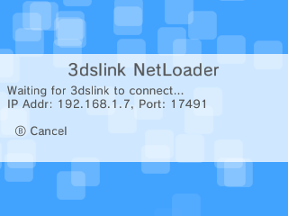

# Homebrew Launcher Link

*A Rust rewrite of [3dslink](https://github.com/devkitPro/3dslink)*

This is a small tool for rapid development of Homebrew titles. It enables you to quickly test your `.3dsx` files directly on your console.

## Usage

Within the homebrew launcher, the `Y` button is a shortcut for the 3dslink NetLoader. When you press it, a popup will apear like this:



Not your console is ready to receive the title, and you can send the file from your development machine:

```sh
$ hbl_link ./hello_world.3dsx
```

By default, the uploader will try to discover your console using a UDP broadcast, but you can skip this with the `--address` option

```sh
$ hbl_link ./hello_world.3dsx --address 192.168.1.7
```

## TODO

- Investigate the [command line of 3dslink](https://github.com/devkitPro/3dslink/blob/master/host/src/main.c#L377-L383)
- Contributing guide
- CI
    - Github Actions
    - Automatic Releases